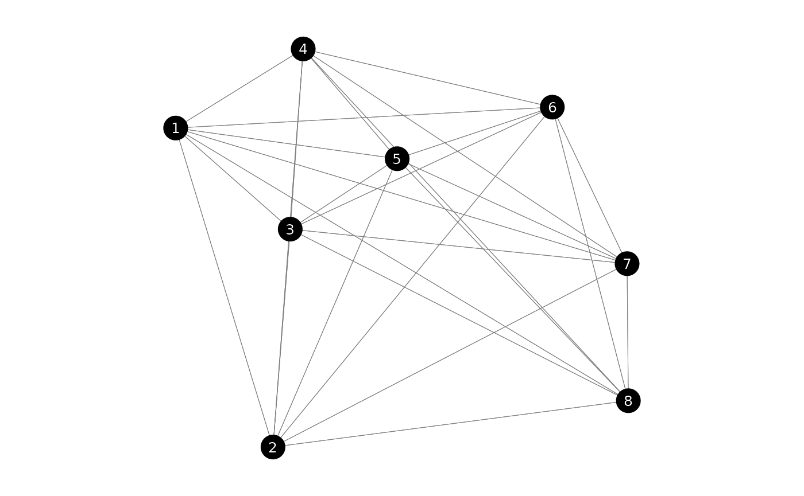
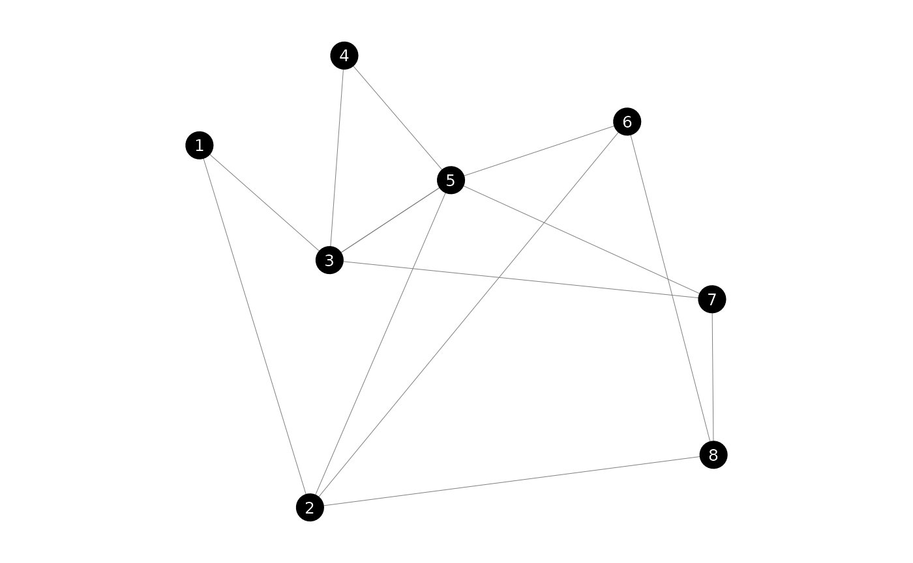
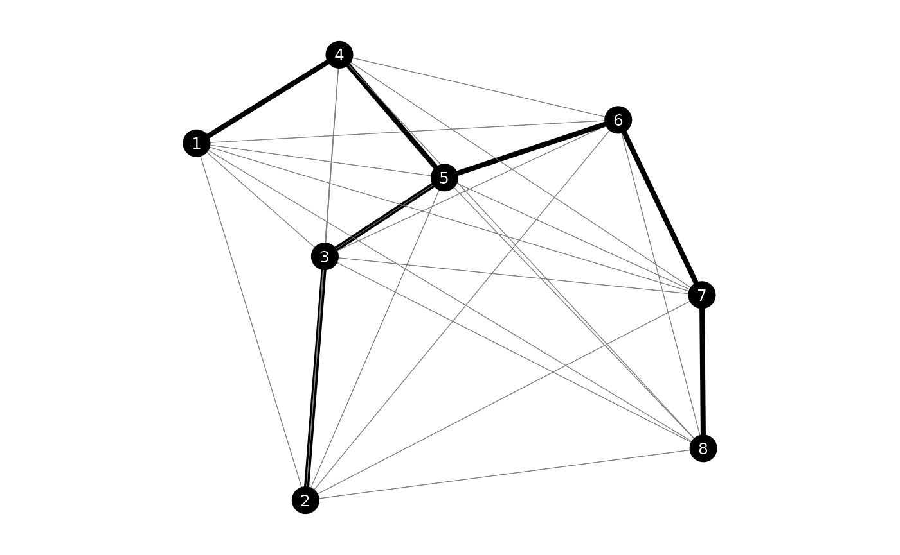

# graphs

This vignette focuses on all sorts of problems relating to graphs. We
will create a complete graph and an incomplete but connected graph.

``` r

library(lpsugar)
library(ROI)
#> ROI: R Optimization Infrastructure
#> Registered solver plugins: nlminb, highs.
#> Default solver: auto.
library(dplyr, warn.conflicts = FALSE)
```

``` r

set.seed(125)
n <- 8

nodes <- tibble(
    x = runif(n),
    y = runif(n)
) |> 
    arrange(x) |> 
    mutate(ind = 1:n)

edges_complete <- expand.grid(from = nodes$ind, to = nodes$ind) |> 
    as_tibble() |> 
    filter(from != to) |> 
    mutate(
        x1 = nodes$x[from],
        x2 = nodes$x[to],
        y1 = nodes$y[from],
        y2 = nodes$y[to],
        dx = x1 - x2,
        dy = y1 - y2,
        cost = sqrt(dx^2 + dy^2),
        dx = NULL, dy = NULL,
        active = FALSE,
    )

edges_connected <- edges_complete |> 
    slice_sample(prop = 0.25, weight_by = 1/cost)

plot_graph(edges_complete)
```



``` r

plot_graph(edges_connected)
```



## Minimum Spanning Tree

### Complete graph

We start by creating the cost matrix. It’s a symetrical square matrix
indicating the distance from each to each node.

``` r

cost <- nodes |> 
    select(x, y) |> 
    dist("euclidean") |> 
    as.matrix()
```

We will solve it as a flow problem. We choose an arbitrary root node and
make it send $`n`$ units of flow, where $`n`$ is the number of nodes.
Each node demands 1 unit.

Our decision variable `flow[i, j]` indicates how many units flow from
node `i` to `j`. Since `flow[i, i]` will be zero, we can fix an upper
bound of 0 for the diagonal of `flow`.

``` r

upper_bound <- matrix(Inf, nrow = n, ncol = n)
diag(upper_bound) <- 0

msp <- lp_problem() |> 
    lp_variable(flow[nodes$ind, nodes$ind], lower = 0, upper = upper_bound)
```

``` r

# Alternatively, but slower
msp <- lp_problem() |> 
    lp_variable(flow[nodes$ind, nodes$ind], lower = 0) |> 
    lp_constraint(diag(flow) == 0)
```

The next step is to set our objective. But for this we will need an
auxiliary binary variable, telling us whether an edge has a flow. We
call this variable `has_flow` and define it as binary. Then we connect
it to our `flow` variable.

``` r

msp <- msp |> 
    lp_variable(has_flow[nodes$ind, nodes$ind], binary = TRUE) |> 
    lp_constraint(flow <= n * has_flow)
```

We can now set the objective.

``` r

msp <- msp |> 
    lp_minimize(sum(cost * has_flow))
```

Now let’s restrict the flow of the rest of the nodes. Let’s choose the
1st node as our root. It will have a supply of $`n`$ units. Each other
node will have a supply of $`0`$ and a demand of $`n`$.

``` r

msp <- msp |> 
    lp_constraint(
        root = sum(flow[1, ]) <= n,
        demand = for (i in nodes$ind) 
            sum(flow[, i]) - sum(flow[i, ]) == 1
    )
```

The full code of the problem is this:

``` r

upper_bound <- matrix(Inf, nrow = n, ncol = n)
diag(upper_bound) <- 0

msp <- lp_problem() |> 
    lp_variable(
        flow[nodes$ind, nodes$ind], 
        lower = 0, upper = upper_bound
    ) |> 
    lp_variable(
        has_flow[nodes$ind, nodes$ind], 
        binary = TRUE
    ) |> 
    lp_minimize(
        sum(cost * has_flow)
    ) |> 
    lp_constraint(
        aux = flow <= n * has_flow,
        root = sum(flow[1, ]) <= n,
        demand = for (i in nodes$ind[-1]) 
            sum(flow[, i]) - sum(flow[i, ]) >= 1
    )
```

Let’s find the solution.

``` r

msp_solution <- lp_solve(msp)
msp_solution$objective
#> [1] 2.097602
msp_solution$variables$has_flow
#>          nodes$ind
#> nodes$ind 1 2 3 4 5 6 7 8
#>         1 0 0 0 1 0 0 0 0
#>         2 0 0 0 0 0 0 0 0
#>         3 0 1 0 0 0 0 0 0
#>         4 0 0 0 0 1 0 0 0
#>         5 0 0 1 0 0 1 0 0
#>         6 0 0 0 0 0 0 1 0
#>         7 0 0 0 0 0 0 0 1
#>         8 0 0 0 0 0 0 0 0
```



## Pathfinding

## Traveling Salesman Problem
