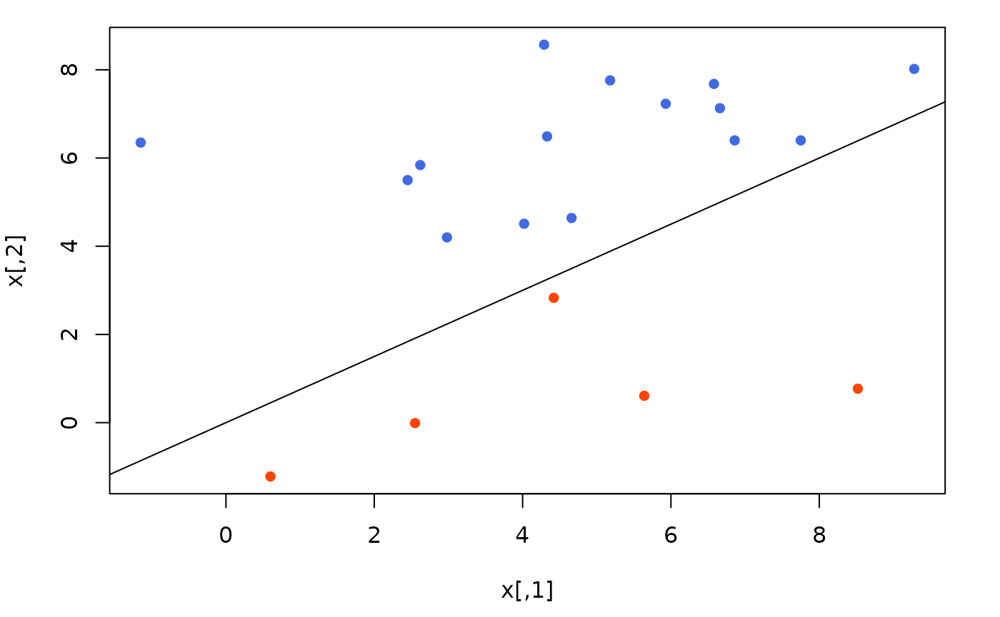
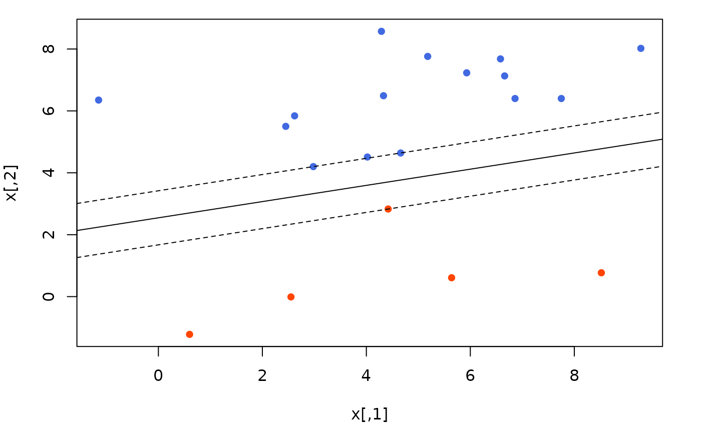
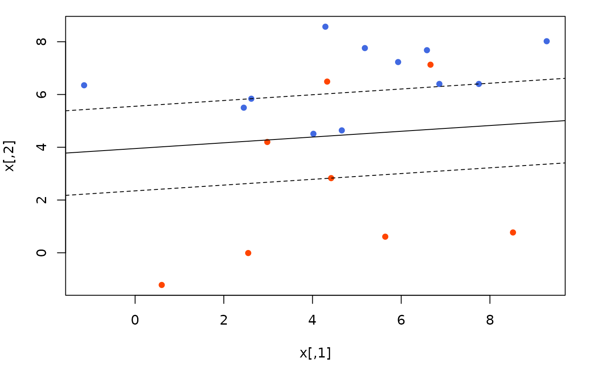

# Regression and Classification

``` r

library(lpsugar)
library(ROI.plugin.highs)
```

This vignette focuses on different regression techniques that can be
solved using linear models.

\\ y_i = \sum\_{j=1}^k{\beta_j x\_{ij}} + e_i \\ We start by generating
the data we’ll use.

``` r

set.seed(123)
n <- 50
k <- 3

true_beta <- c(2, 3, -5)

x <- rpois(n*k, 6) |> matrix(n, k)
y <- x %*% true_beta + rnorm(n)
```

    #>  x1 x2 x3          y
    #>   5  2  6 -12.974429
    #>   8  5  5   5.715227
    #>   5  8  6   2.779282
    #>   9  3 10 -22.818697
    #>  10  6  6   7.861109
    #> ... and 45 more rows

## Least Absolute Deviation

The objective of Least Absolute Deviation (LAD) regression is to
minimize the absolute residuals.

\\ \min{\sum\_{i=1}^n{\|e_i\|}} \\

The absolute value function \\\|e\|\\ is not linear, so we have to
separate each \\e_i\\ into:

\\ e_i = e_i^+ - e_i^- \\ \\ e_i^+ \ge 0,\\ e_i^- \ge 0 \\ Then the
problem can be written like this:

\\ \begin{array}{rl} \min & \sum\_{i=1}^n{e_i^+ + e_i^-} \\ \text{st} &
e_i^+ \ge y_i - \hat{y_i} \\ & e_i^- \ge \hat{y_i} - y_i \\ & e_i^+ \ge
0 \\ & e_i^- \ge 0 \\ \text{where} & \hat{y_i} = \sum\_{j=1}^k{\beta_j
x\_{ij}} \end{array} \\

This works. The objective function attempts to push both \\e_i^+\\ and
\\e_i^-\\ down, but the constraints ensure that:

- If \\e_i \> 0\\ \Rightarrow\\ e_i^+ = e_i,\\ e_i^- = 0\\.

- If \\e_i \< 0\\ \Rightarrow\\ e_i^+ = 0,\\ e_i^- = \|e_i\|\\.

Let’s write the problem in `lpsugar`.

``` r

n <- nrow(x)
k <- ncol(x)

lad <- lp_problem() |> 
    lp_var(beta[1:k]) |> 
    lp_var(e_pos[1:n], lower = 0) |> 
    lp_var(e_neg[1:n], lower = 0) |> 
    lp_min(sum(e_pos + e_neg)) |> 
    lp_alias(yhat = x %*% beta) |> 
    lp_con(
        pos = e_pos >= y - yhat,
        neg = e_neg >= yhat - y
    ) |> 
    lp_solve(solver = "highs")
```

The estimated \\\hat{\beta}\\ is quite similar to the `true_beta`
\\\beta\\.

``` r

cbind(
    true_beta = true_beta,
    lad_beta = lad$variables$beta |> round(2)
)
#>      true_beta lad_beta
#> [1,]         2     1.99
#> [2,]         3     2.96
#> [3,]        -5    -4.97
```

And the absolute deviation is:

``` r

lad$objective
#> [1] 32.79285
```

## Support Vector Machines

Support Vector Machines (SVM) are a binary classification method, that
uses a hyperplane to separate the groups.

\\ x\_{ij} \in \mathbb{R} \qquad i \in \[1,n\],\\ j\in \[1,k\] \\ \\ y_i
\in \\\text{TRUE},\\ \text{FALSE}\\ \qquad i \in \[1,n\] \\

Usually, \\y\\ is represented as \\y_i \in \\-1, +1\\\\, but I believe
it’s easier to understand as a boolean variable.

### Basic Idea

An SVM finds a vector \\\\w_j\\\_{j\in\[1,k\]}\\ and scalar \\b\\ that
represents a hyperplane \\h\\:

\\ h : \sum\_{j=1}^k{(h\_{j} w\_{j})} + b = 0 \\

Classifications works like this. When the hyperplane expression is
positive \\y_i\\ is predicted `TRUE`; when the expression is negative
\\y_i\\ is predicted `FALSE`.

\\ \sum\_{j=1}^k{(x\_{ij} w\_{j})} + b \> 0 \Rightarrow y_i=\text{TRUE}
\qquad \forall i\in\[1,n\] \\ \\ \sum\_{j=1}^k{(x\_{ij} w\_{j})} + b \<
0 \Rightarrow y_i=\text{FALSE} \qquad \forall i\in\[1,n\] \\ With this
randomly generated data, we can find a line (which is an
\\\mathbb{R}^2\\ hyperplane) that perfectly separates orange from blue.



However, this is not the *best* separator. There are two methods of
finding a better one, a Hard Margin SVM and a Soft Margin SVM.

### Hard Margin

The goal of an SVM is to find the greatest possible *margin*. The margin
is the smallest distance from a point to the hyperplane. Minimizing the
margin is equivalent to minimizing the quadratic sum of \\w\\
coefficients.

\\ \min_w \sum\_{j=1}^k{w_j^2} \\

And these constraints ensure the prediction is always correct.

\\ \sum\_{j=1}^k{(x\_{ij} w\_{j})} + b \ge +1 \qquad \forall i : y_i =
\text{TRUE} \\ \\ \sum\_{j=1}^k{(x\_{ij} w\_{j})} + b \le -1 \qquad
\forall i : y_i = \text{FALSE} \\

The Hard Margin SVM can be written in `lpsugar` with the following code.

``` r

svm_hard <- lp_problem() |> 
    lp_var(w[1:k]) |> 
    lp_var(b) |> 
    lp_min(sum(w^2)) |> 
    lp_constraint(
        true_y = for (i in which(y)) {
            predicted <- sum_over(j = 1:k, x[i,j] * w[j]) + b
            predicted >= +1
        },
        false_y = for (i in which(!y)) {
            predicted <- sum_over(j = 1:k, x[i,j] * w[j]) + b
            predicted <= -1
        }
    ) |> 
    lp_solve(solver = "highs")
```

This is the result. The continuous line represent the hyperplane, and
the dashed lines represent the points where the hyperplane formula is
\\+1\\ and \\-1\\.



### Soft Margin

Soft Margin SVMs allow some prediction errors. This means they support
data that cannot be linearly separated. A Hard Margin SVM would fail to
find a feasible solution with this data.


We will introduce a slack variable \\\xi_i \ge 0\\ indicating the
prediction error for observation \\i\\. Naturally, we want to minimize
the prediction error, so we will update the objective function:

\\ \min_w \sum\_{j=1}^k{w_j^2} + C\sum\_{i=1}^n{\xi_i} \\

Where \\C\\ is known as the Regularization Hyperparameter.

The constraints will now allow some flexibility by adding the slack
variables \\\xi\\:

\\ \sum\_{j=1}^k{(x\_{ij} w\_{j})} + b \ge +1 - \xi_i \qquad \forall i :
y_i = \text{TRUE} \\ \\ \sum\_{j=1}^k{(x\_{ij} w\_{j})} + b \le -1 +
\xi_i \qquad \forall i : y_i = \text{FALSE} \\

In `lpsugar`, the Soft Margin SVM can be coded as follows.

``` r

C <- 5 # Regularization Hyperparameter

svm_soft <- lp_problem() |> 
    lp_var(w[1:k]) |> 
    lp_var(b) |> 
    lp_var(slack[1:n], lower = 0) |> 
    lp_min(sum(w^2) + C * sum(slack)) |> 
    lp_constraint(
        true_y = for (i in which(y)) {
            predicted <- sum_over(j = 1:k, x[i,j] * w[j]) + b
            predicted >= +1 - slack[i]
        },
        false_y = for (i in which(!y)) {
            predicted <- sum_over(j = 1:k, x[i,j] * w[j]) + b
            predicted <= -1 + slack[i]
        }
    ) |> 
    lp_solve(solver = "highs")
```

Notice that all blue values fall on top of the hyperplane, but some
orange values are incorrectly predicted.


