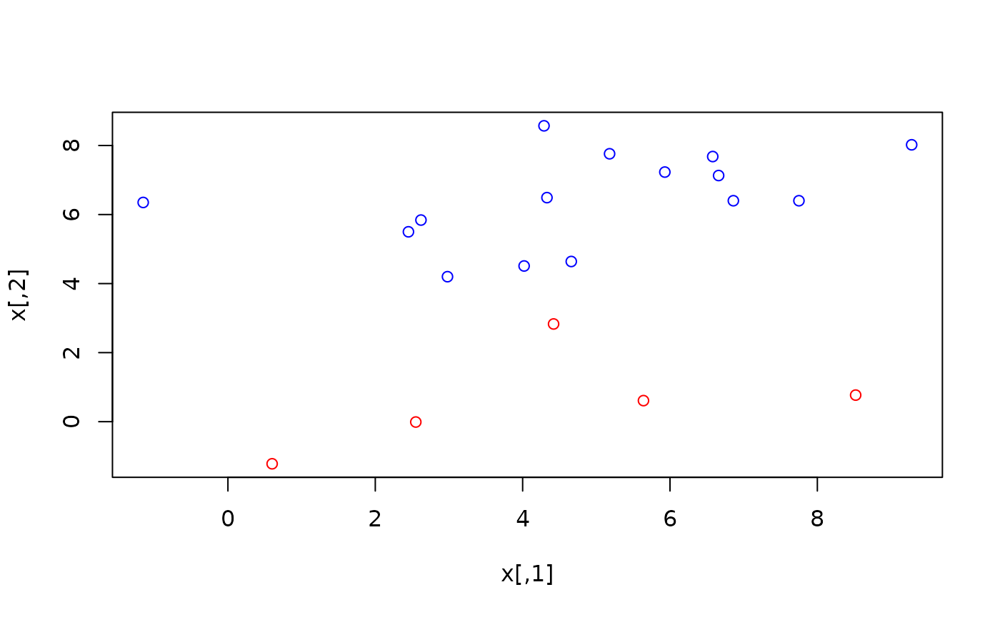
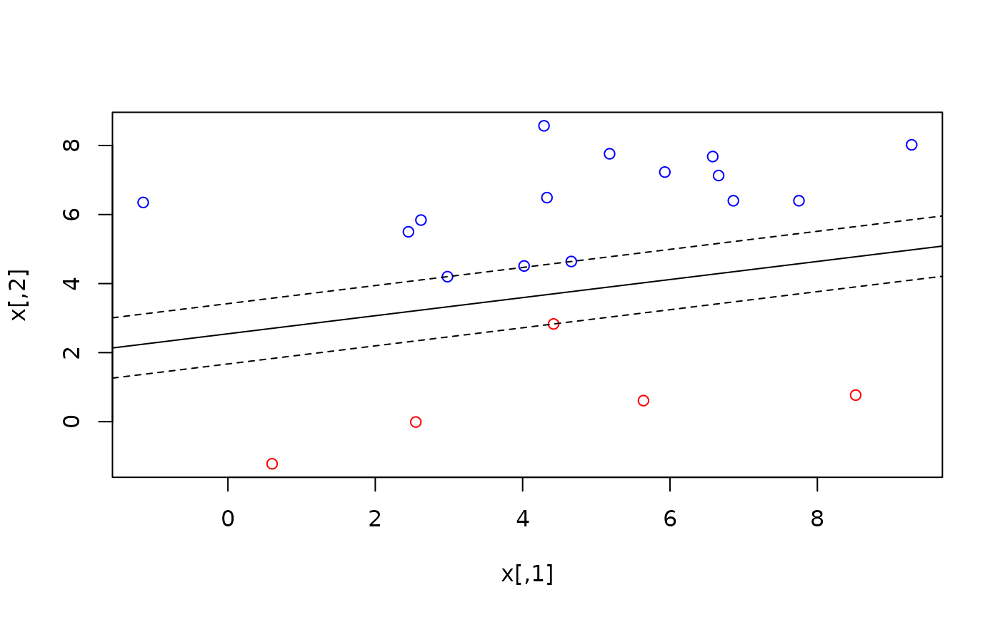
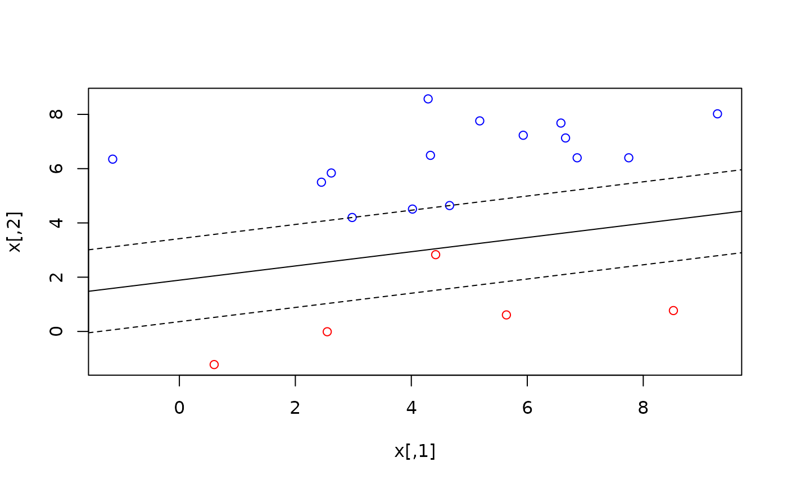

# regression

``` r

library(lpsugar)
library(ROI.plugin.highs)
```

This vignette focuses on different regression techniques that can be
solved using linear models.

\\ y_i = \sum\_{j=1}^k{\beta_j x\_{ij}} + e_i \\ We start by generating
the data we’ll use.

``` r

set.seed(123)
n <- 50
k <- 3

true_beta <- c(2, 3, -5)

x <- matrix(rpois(n*k, 6), nrow = n, ncol = k)
x[, 1] <- 1
head(x)
#>      [,1] [,2] [,3]
#> [1,]    1    2    6
#> [2,]    1    5    5
#> [3,]    1    8    6
#> [4,]    1    3   10
#> [5,]    1    6    6
#> [6,]    1    4    9

e <- rnorm(n)
y <- (x %*% true_beta) + e
head(y)
#>            [,1]
#> [1,] -20.974429
#> [2,]  -8.284773
#> [3,]  -5.220718
#> [4,] -38.818697
#> [5,] -10.138891
#> [6,] -30.994236
```

## Least Absolute Deviation

The objective of Least Absolute Deviation (LAD) regression is to
minimize the absolute residuals.

\\ \min{\sum\_{i=1}^n{\|e_i\|}} \\

The absolute value function \\\|e\|\\ is not linear, so we have to
separate each \\e_i\\ into:

\\ e_i = e_i^+ - e_i^- \\ \\ e_i^+ \ge 0,\\ e_i^- \ge 0 \\ Then the
problem can be written like this:

\\ \begin{array}{rl} \min & \sum\_{i=1}^n{e_i^+ + e_i^-} \\ \text{st } &
e_i^+ \ge y_i - \hat{y_i} \\ & e_i^- \ge \hat{y_i} - y_i \\ & e_i^+ \ge
0 \\ & e_i^- \ge 0 \\ \text{where } & \hat{y_i} = \sum\_{j=1}^k{\beta_j
x\_{ij}} \end{array} \\

This works. The objective function attempts to push both \\e_i^+\\ and
\\e_i^-\\ down, but the constraints ensure that:

- If \\e_i \> 0\\ \Rightarrow\\ e_i^+ = e_i,\\ e_i^- = 0\\.

- If \\e_i \< 0\\ \Rightarrow\\ e_i^+ = 0,\\ e_i^- = \|e_i\|\\.

Let’s write the problem in `lpsugar`.

``` r

n <- nrow(x)
k <- ncol(x)

lad <- lp_problem() |> 
    lp_var(beta[1:k]) |> 
    lp_var(e_pos[1:n], lower = 0) |> 
    lp_var(e_neg[1:n], lower = 0) |> 
    lp_min(sum(e_pos + e_neg)) |> 
    lp_alias(yhat = x %*% beta) |> 
    lp_con(
        pos = e_pos >= y - yhat,
        neg = e_neg >= yhat - y
    ) |> 
    lp_solve()
```

The estimated \\\hat{\beta}\\ is quite similar to the `true_beta`
\\\beta\\.

``` r

cbind(
    true_beta = true_beta,
    lad_beta = lad$variables$beta |> round(2)
)
#>   true_beta lad_beta
#> 1         2     1.83
#> 2         3     2.98
#> 3        -5    -4.97
```

And the absolute deviation is:

``` r

lad$objective
#> [1] 32.76798
```

## Support Vector Machines

``` r

set.seed(101)
n <- 20
k <- 2

true_w <- c(3, -4)
true_b <- 2

x <- rnorm(n*k, mean = 5, sd = 3) |> 
    round(2) |> 
    matrix(n, k)

head(x)
#>      [,1] [,2]
#> [1,] 4.02 4.51
#> [2,] 6.66 7.13
#> [3,] 2.98 4.20
#> [4,] 5.64 0.61
#> [5,] 5.93 7.23
#> [6,] 8.52 0.77

y <- (x %*% true_w + true_b) > 0
head(y)
#>       [,1]
#> [1,] FALSE
#> [2,] FALSE
#> [3,] FALSE
#> [4,]  TRUE
#> [5,] FALSE
#> [6,]  TRUE

plot(x, col = ifelse(y, "red", "blue"))
```



### Hard Margin

``` r

svm_hard <- lp_problem() |> 
    lp_var(w[1:k]) |> 
    lp_var(b) |> 
    lp_min(sum(w^2)) |> 
    lp_constraint(
        hard_margin = for (i in 1:n) {
            predicted <- sum_over(j = 1:k, x[i,j] * w[j]) + b
            
            if (y[i]) {
                predicted >= +1
            } else {
                predicted <= -1
            }
        }
    ) |> 
    lp_solve()
```

``` r

plot(x, col = ifelse(y, "red", "blue"))

# w[1] * x[1] + w[2] * x[2] + b = 0
# x[2] = - b / w[2] - x[1] * w[1] / w[2]
with(svm_hard$variables, {
     abline(a = - b / w[2], b = - w[1] / w[2])
     abline(a = (+1 - b) / w[2], b = - w[1] / w[2], lty = 2)
     abline(a = (-1 - b) / w[2], b = - w[1] / w[2], lty = 2)
})
```



### Soft Margin

``` r

C <- 0.8 # Regularization hyperparameter

svm_soft <-  lp_problem() |> 
    lp_var(w[1:k]) |> 
    lp_var(b) |> 
    lp_var(slack[1:n], lower = 0) |> 
    lp_min(sum(w^2) + C * sum(slack)) |> 
    lp_constraint(
        soft_margin = for (i in 1:n) {
            predicted <- sum_over(j = 1:k, x[i,j] * w[j]) + b
            
            if (y[i]) {
                predicted >= +1 - slack[i]
            } else {
                predicted <= -1 + slack[i]
            }
        }
    ) |> 
    lp_solve()
```

``` r

plot(x, col = ifelse(y, "red", "blue"))

# w[1] * x[1] + w[2] * x[2] + b = 0
# x[2] = - b / w[2] - x[1] * w[1] / w[2]
with(svm_soft$variables, {
     abline(a = - b / w[2], b = - w[1] / w[2])
     abline(a = (+1 - b) / w[2], b = - w[1] / w[2], lty = 2)
     abline(a = (-1 - b) / w[2], b = - w[1] / w[2], lty = 2)
})
```


